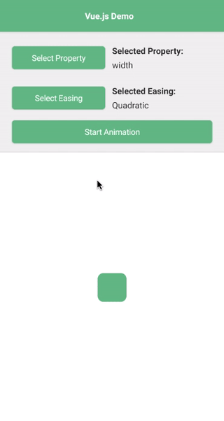

# NativeScript Tween

[](https://www.npmjs.com/package/@nativescript-community/tween)
[](https://www.npmjs.com/package/@nativescript-community/tween)
[](https://www.npmjs.com/package/@nativescript-community/tween)

A NativeScript plugin that natively wraps [tween.js](https://github.com/tweenjs/tween.js/), a tweening engine for easy animations, incorporating optimized Robert Penner's equations.

|  |  |
| --- | ----------- |
| iOS Demo | Android Demo | 

## Table of Contents
1. [Installation](#installation)
2. [Configuration](#configuration)
3. [API](#api)
4. [Usage in Angular](#usage-in-angular)
5. [Usage in Vue](#usage-in-vue)
6. [Usage in Svelte](#usage-in-svelte)
7. [Usage in React](#usage-in-react)
8. [Demos](#demos)

## Installation

Run the following command from the root of your project:

`ns plugin add @nativescript-community/tween`

## Configuration

No futher configuration is needed.

## API

This plugin exports the same API as `tween.js`.

Refer to the offical [tween.js user guide](https://github.com/tweenjs/tween.js/blob/master/docs/user_guide.md) additional examples and information.

For now grouping, chaining, repeating... are not supported. Just basic tweening.

Any view property that is a number should technically be able to be tweened. All of these have not been tested, but some of the common ones that work are:
 - `width`
 - `height`
 - `rotate`
 - `scaleX`
 - `scaleY`
 - `translateX`
 - `translateY`
 - `opacity`

The following are available tween easing options:

 - `TWEEN.Easing.Linear.None`
 - `TWEEN.Easing.Quadratic.In`
 - `TWEEN.Easing.Quadratic.Out`
 - `TWEEN.Easing.Cubic.In`
 - `TWEEN.Easing.Cubic.Out`
 - `TWEEN.Easing.Quartic.In`
 - `TWEEN.Easing.Quartic.Out`
 - `TWEEN.Easing.Quintic.In`
 - `TWEEN.Easing.Quintic.Out`
 - `TWEEN.Easing.Sinusoidal.In`
 - `TWEEN.Easing.Sinusoidal.Out`
 - `TWEEN.Easing.Exponential.In`
 - `TWEEN.Easing.Exponential.Out`
 - `TWEEN.Easing.Circular.In`
 - `TWEEN.Easing.Circular.Out`
 - `TWEEN.Easing.Elastic.In`
 - `TWEEN.Easing.Elastic.Out`
 - `TWEEN.Easing.Back.In`
 - `TWEEN.Easing.Back.Out`
 - `TWEEN.Easing.Bounce.In`
 - `TWEEN.Easing.Bounce.Out`

## Usage in Angular

The following is a very simple example of getting tweens to run in your Angular project.

Create a view that you would like to animate as well as a button to trigger it in your component's HTML file.
```xml
<StackLayout>
    <Button text="Start Animation" (tap)="startTween()" verticalAlignment="top"></Button>

    <AbsoluteLayout #box width="30" height="30" backgroundColor="red" horizontalAlignment="center" verticalAlignment="center"></AbsoluteLayout>
</StackLayout>
```

Reference the view you want to animate in your component's typescript file with the following (and add required imports):

```typescript
boxRef: AbsoluteLayout;
@ViewChild("box", { static: true }) boxElementRef: ElementRef;

ngOnInit(): void {
    this.boxRef = this.boxElementRef.nativeElement;
}
```

Import the tween module in your component's typescript file:
```typescript
import { TWEEN } from '@nativescript-community/tween';
```

Create a function that will contain the call to run the tween.

```typescript
startTween() {
    new TWEEN.Tween({ value: 30 })
        .easing(TWEEN.Easing.Quadratic.In)
        .to({ value: 300 }, 1000)
        .onStart(() => {
            console.log("The tween has stated...");
        })
        .onComplete(() => {
            console.log("The tween has completed...");
        })
        .onUpdate(obj => {
            this.boxRef.width = obj.value;
        })
        .start();
}
```

That should be all you need! Now, when you tap the button `Start Animation`, the box's width should go from `30` to `300`.

Look in the `demo-ng` directory for a more advanced demo.

## Usage in Vue

The following is a very simple example of getting tweens to run in your Vue project.

Create a view that you would like to animate as well as a button to trigger it.
```xml
<StackLayout>
    <Button text="Start Animation" @tap="startTween" />
    <AbsoluteLayout ref="box" width="30" height="30" backgroundColor="red" horizontalAlignment="center" verticalAlignment="center"></AbsoluteLayout>
</StackLayout>
```

Reference the view you want to animate in your component `computed` section:

```typescript
// ...
computed: {
    boxRef(){
        return this.$refs.box.nativeView;
    }     
},
// ...
```

Import the tween module in your component:
```typescript
import { TWEEN } from '@nativescript-community/tween';
```

Create a function that will contain the call to run the tween.

```typescript
startTween() {
    new TWEEN.Tween({ value: 30 })
        .easing(TWEEN.Easing.Quadratic.In)
        .to({ value: 300 }, 1000)
        .onStart(() => {
            console.log("The tween has stated...");
        })
        .onComplete(() => {
            console.log("The tween has completed...");
        })
        .onUpdate(obj => {
            this.boxRef.width = obj.value;
        })
        .start();
}
```

That should be all you need! Now, when you tap the button `Start Animation`, the box's width should go from `30` to `300`.

Look in the `demo-vue` directory for a more advanced demo.

## Usage in Svelte

The following is a very simple example of getting tweens to run in your Svelte project.

Create a view that you would like to animate as well as a button to trigger it.
```xml
<stackLayout>
    <button text="Start Animation" on:tap="{startTween}" />
    <absoluteLayout bind:this="{boxRef}" width="30" height="30" backgroundColor="red" horizontalAlignment="center" verticalAlignment="center"></absoluteLayout>
</stackLayout>
```

Reference the view you want to animate in your component.

```typescript
let boxRef: AbsoluteLayout;
onMount(() => {
    boxRef = boxRef.nativeView;
})
```

Import the tween module in your component:
```typescript
import { TWEEN } from '@nativescript-community/tween';
```

Create a function that will contain the call to run the tween.

```typescript
function startTween() {
    new TWEEN.Tween({ value: 30 })
        .easing(TWEEN.Easing.Quadratic.In)
        .to({ value: 300 }, 1000)
        .onStart(() => {
            console.log("The tween has stated...");
        })
        .onComplete(() => {
            console.log("The tween has completed...");
        })
        .onUpdate(obj => {
            boxRef.width = obj.value;
        })
        .start();
}
```

That should be all you need! Now, when you tap the button `Start Animation`, the box's width should go from `30` to `300`.

Look in the `demo-svelte` directory for a more advanced demo.

## Usage in React

The following is a very simple example of getting tweens to run in your React project.

Create a view that you would like to animate as well as a button to trigger it.
```xml
<stackLayout>
    <button text="Start Animation" onTap={startTween} />
    <absoluteLayout ref={boxRef} width="30" height="30" backgroundColor="red" horizontalAlignment="center" verticalAlignment="middle"></absoluteLayout>
</stackLayout
```

Reference the view you want to animate in your component.

```typescript
const boxRef = React.useRef<NSVElement<AbsoluteLayout>>(null);
```

Import the tween module in your component:
```typescript
import { TWEEN } from '@nativescript-community/tween';
```

Create a function that will contain the call to run the tween.

```typescript
function startTween() {
    new TWEEN.Tween({ value: 30 })
        .easing(TWEEN.Easing.Quadratic.In)
        .to({ value: 300 }, 1000)
        .onStart(() => {
            console.log("The tween has stated...");
        })
        .onComplete(() => {
            console.log("The tween has completed...");
        })
        .onUpdate(obj => {
            boxRef.current!.nativeView.width = obj.value;
        })
        .start();
}
```

That should be all you need! Now, when you tap the button `Start Animation`, the box's width should go from `30` to `300`.

Look in the `demo-react` directory for a more advanced demo

## Demos

This repository includes Angular, Vue.js, Svelte, and React demos. In order to run these execute the following in your shell:
```shell
$ git clone https://github.com/@nativescript-community/tween
$ cd tween
$ npm i
$ npm run build
$ cd demo-ng # or demo-vue or demo-svelte or demo-react
$ ns run ios|android
```